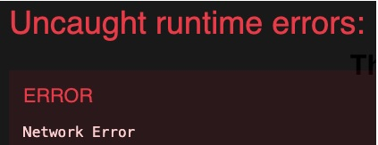

 It's my very first time to clone well-known other's Github repository code. And I realized that 

1. I don't have to follow the instructions Readme file says. 
In this SWR project, the Readme file talks about yarn, but I didn't even use yarn and just used npm like usual. 

2. pathNotExported에러라고 하여 아래 그림과 같은 에러가 나오는데 그냥 강제 install해주면 해결할 수 있다.
참고:  https://velog.io/@kwakwoohyun/React.js-Error-ERRPACKAGEPATHNOTEXPORTED-No-exports

3. Though the error message is saying it has problem in network, there is always probability it is related to CORS(Cross Origin Resource Sharing)issue. 왜냐하면 브라우저에서 보안상의 이유로 HTTP요청들을 제한한다. 즉 브라우저를 사용한다면 이렇게 브라우저가 요구하는 조건을 들어주어야 하는 것이다. 좀더 구체적으로 브라우저는 HTTP의 HEADER를 살펴서 CORS의 조건을 살핀다. 참고:  

4. js의 optional chaining문법 
## "?."

객체를 사용할 때, 속성이 undefiend이거나 null일 수 있다. 참조값이 undefiend나 null이면 error를 발생시키는 대신 undefiend를 return한다.
	
const adventurer = {
  name: 'Alice',
  cat: {
    name: 'Dinah'
  }
};
 
const dogName = adventurer.dog?.name;
console.log(dogName);
// expected output: undefined
 
console.log(adventurer.someNonExistentMethod?.());
// expected output: undefined
 

adventurer 객체의 .dog속성에 접근하려 한다. 원래는 adventurer.dog는 없으므로 error가 나타난다. 하지만

adventurer.dog?.name은 error대신 undefiend를 return한다.

아래의 adventurer.someNonExistentMethod?.()도 마찬가지이다.

 

?.는 앞의 속성에 접근하기 전에 null이나 undefiend가 아닌지 검증한 후, 다음 속성에 접근해 error를 막는다.